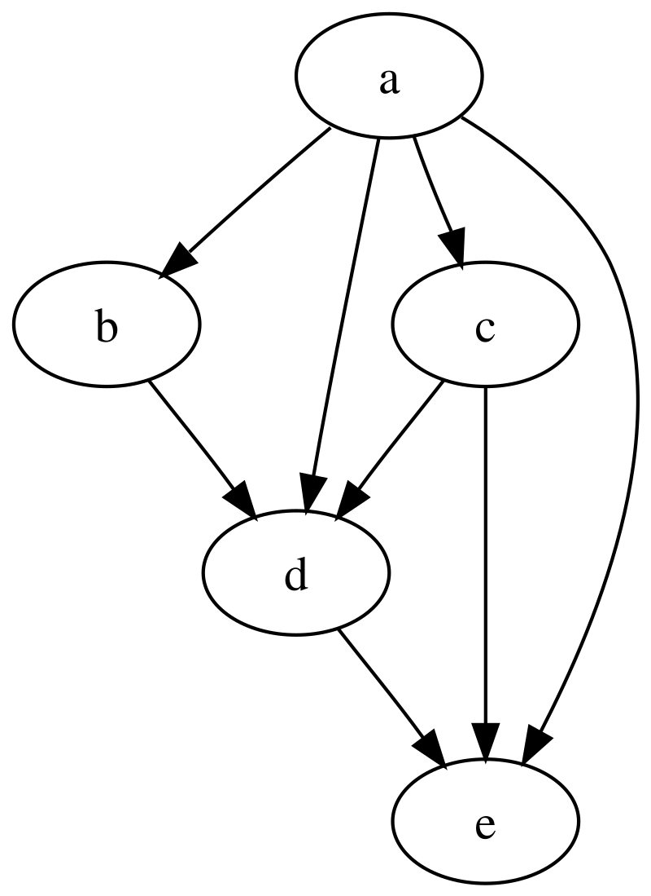

# Zynk – High-Performance Workflow Engine

Zynk is a high-performance workflow execution system written in C++. It allows users to model complex tasks as composable graphs of subtasks, enabling automation of structured processes such as report generation, notification pipelines, data transformations, and more.

---

## Workflow Model

A workflow is represented as a directed acyclic graph (DAG), where:

- Nodes represent discrete subtasks (e.g., "fetch data", "summarize text", "send email")
- Edges define dependencies between nodes
- A node can access any value produced by its ancestor nodes

This model allows for flexible composition and reuse of logic in parallel and sequential flows.

### Example Use Case

Generate a weekly report by chaining three subtasks:

1. Fetch relevant documents from the past week
2. Summarize them into a report using an LLM
3. Send the generated report via email

---

### Example DAG

In this example:

- `a` is the root node and executes first.
- `b` and `c` depend on `a`.
- `d` depends on `a`, `b`, and `c` — it must wait for all of them to finish.
- `e` depends on both `c` and `d`, and is the final step.

---

## Execution Semantics

- Before a node can run, all its dependencies must be fully completed
- The solution of a workflow graph is an execution order that satisfies all dependency constraints
- Cycles are illegal, as they would make execution impossible
- Zynk executes nodes in a multi-threaded environment to exploit parallelism
- Zynk does not modify the graph during execution; the user’s design directly impacts performance

General recommendation: favor breadth (parallel branches) over depth (long sequential chains) to maximize concurrency and throughput.

---

## Node Bindings

Zynk supports the implementation of node logic in:

- C++ (native, recommended for performance-critical tasks)
- Python (via bindings, suitable for data processing and rapid development)

Each node runs in a sandboxed context and can return values that are accessible to all of its descendant nodes.

---

## Interfaces

### REST API

- Trigger workflow execution via HTTP request
- Submit inputs, configuration, or workflow parameters in the payload
- Receive job ID or initial execution status

### WebSocket API

- Subscribe to real-time updates of workflow execution
- Events include:
  - Node started
  - Node completed
  - Workflow completed
  - Workflow failed

> We use Zynk in [Kayf](https://github.com/ZeltLabs/kayf) to power high-performance, automated workflows across distributed knowledge and communication systems.
